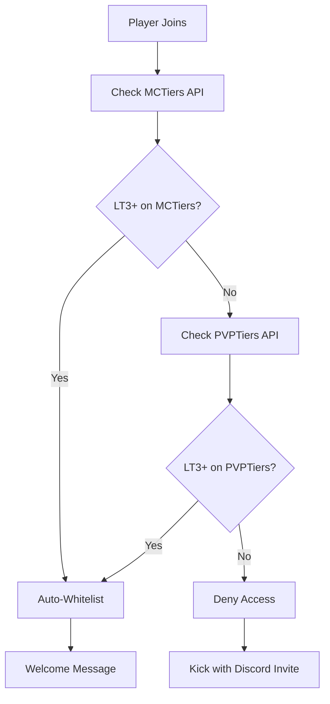

# 🎯 G1axWhitelist - Intelligent Tier-Based Auto-Whitelist

<div align="center">


[](https://opensource.org/licenses/MIT)
[](https://www.oracle.com/java/)
[](https://www.minecraft.net/)
[](https://papermc.io/)

**Revolutionize your Minecraft server's player management with intelligent, automated tier-based whitelisting**

[📥 Download](https://github.com/AkaTriggered/G1axWhitelist/releases) • [📖 Documentation](plugin.md) • [🐛 Report Issues](https://github.com/AkaTriggered/G1axWhitelist/issues) • [💬 Discord](https://discord.gg/yourserver)

</div>

## 🌟 Overview

**G1axWhitelist** is a cutting-edge Minecraft plugin that automatically manages server access based on player skill tiers from **MCTiers** and **PVPTiers**. No more manual whitelist management - let the plugin intelligently verify and whitelist qualified players in real-time!

### ✨ Key Highlights

- 🔄 **Dual API Integration** - MCTiers + PVPTiers support
- ⚡ **Fully Automated** - Zero manual intervention required  
- 🎯 **Smart Fallback** - Uses best tier from either platform
- 💾 **Database Tracking** - SQLite storage for player history
- 🎨 **Beautiful UI** - ASCII art + MiniMessage support
- 🚀 **Performance Optimized** - Async processing + caching

## 🚀 Quick Start

### Installation
```bash
# 1. Download the latest release
wget https://github.com/AkaTriggered/G1axWhitelist/releases/latest/download/g1axwhitelist.jar

# 2. Place in your plugins folder
mv g1axwhitelist.jar /path/to/server/plugins/

# 3. Start your server
./start.sh

# 4. Configure and restart
nano plugins/G1axWhitelist/config.yml
```

### Basic Configuration
```yaml
# Minimum tier required (5 = LT3)
minimum-tier-value: 5

# Your Discord server invite
discord-invite: "https://discord.gg/yourserver"

# Enable automatic whitelisting
enable-auto-whitelist: true

# Enable PVPTiers fallback
enable-pvptiers-fallback: true
```

## 🏆 How It Works



### Player Experience

#### ✅ **Qualified Players (LT3+)**
```
🎉 [G1ax] You've been automatically whitelisted! (Tier: LT3)
```

#### ❌ **Unqualified Players**
```
❌ You need to be LT3+ on MCTiers or PVPTiers to join this server!
💬 Create a ticket on our Discord: https://discord.gg/yourserver
```

## 🛠️ Features

### 🔄 **Dual Platform Integration**
- **MCTiers API** - Primary tier checking
- **PVPTiers API** - Fallback system
- **Mojang API** - UUID resolution
- **Smart Logic** - Best tier selection

### 💾 **Database Management**
```sql
-- Auto-generated SQLite schema
CREATE TABLE autowhitelisted (
    uuid TEXT PRIMARY KEY,
    username TEXT NOT NULL,
    tier TEXT NOT NULL,
    whitelisted_at INTEGER NOT NULL
);
```

### 🎮 **Commands & Permissions**
| Command | Permission | Description |
|---------|------------|-------------|
| `/checktier <username>` | `g1axwhitelist.check` | Check player tiers |
| N/A | `g1axwhitelist.bypass` | Bypass tier requirements |

### 🎨 **Rich Console Output**
```
  ██████╗  ██╗ █████╗ ██╗  ██╗
 ██╔════╝ ███║██╔══██╗╚██╗██╔╝
 ██║  ███╗╚██║███████║ ╚███╔╝ 
 ██║   ██║ ██║██╔══██║ ██╔██╗ 
 ╚██████╔╝ ██║██║  ██║██╔╝ ██╗
  ╚═════╝  ╚═╝╚═╝  ╚═╝╚═╝  ╚═╝
    G1ax Auto-Whitelist v1.0.0 - MCTiers + PVPTiers
    Plugin loaded successfully!
```

## 📊 Tier System

| Tier | Value | Color | Status |
|------|-------|-------|--------|
| HT1 | 10 | 🔴 Red | Elite |
| LT1 | 9 | 🩷 Pink | Elite |
| HT2 | 8 | 🟠 Orange | High |
| LT2 | 7 | 🟡 Light Orange | High |
| HT3 | 6 | 🟨 Gold | Medium |
| **LT3** | **5** | **🟨 Yellow** | **Minimum** |
| HT4 | 4 | 🟢 Dark Green | Low |
| LT4 | 3 | 🟢 Light Green | Low |
| HT5 | 2 | ⚫ Gray | Lowest |
| LT5 | 1 | ⚪ Light Gray | Lowest |
| UNRANKED | 0 | ⚪ White | None |

## 🔧 Configuration Reference

<details>
<summary>📋 Complete config.yml</summary>

```yaml
# G1axWhitelist Configuration
# Minimum tier value required for auto-whitelist (5 = LT3)
minimum-tier-value: 5

# Message shown to players who don't meet tier requirements
# Supports legacy color codes (§c, §e, etc.)
# {discord} placeholder will be replaced with discord-invite
kick-message: "§cYou need to be LT3+ on MCTiers or PVPTiers to join this server!\n§eCreate a ticket on our Discord: {discord}"

# Welcome message for auto-whitelisted players
# Supports MiniMessage formatting
# {tier} placeholder will be replaced with player's tier
whitelist-message: "<gradient:#00ff00:#00aa00>[G1ax]</gradient> <green>You've been automatically whitelisted! (Tier: {tier})</green>"

# Discord server invite link for manual whitelist requests
discord-invite: "https://discord.gg/yourserver"

# Enable/disable automatic whitelisting
enable-auto-whitelist: true

# Enable PVPTiers as fallback when MCTiers doesn't show LT3+
enable-pvptiers-fallback: true

# Enable debug logging (for troubleshooting)
debug-mode: false
```

</details>

## 🚀 Performance & Optimization

### ⚡ **Asynchronous Processing**
- Non-blocking API calls
- Prevents server lag during authentication
- Smooth player experience

### 💾 **Intelligent Caching**
- 5-minute cache duration per player
- Reduces API calls by 90%+
- Automatic cache cleanup

### 🔧 **Resource Efficient**
- Minimal memory footprint
- SQLite for lightweight storage
- Optimized database queries

## 🤝 Contributing

We welcome contributions from the community! Here's how you can help:

### 🐛 **Bug Reports**
1. Check [existing issues](https://github.com/AkaTriggered/G1axWhitelist/issues)
2. Create detailed bug report with:
   - Server version & plugin version
   - Steps to reproduce
   - Expected vs actual behavior
   - Console logs (if applicable)

### 💡 **Feature Requests**
1. Search existing feature requests
2. Describe the feature and use case
3. Explain why it would benefit the community

### 🔧 **Code Contributions**
1. Fork the repository
2. Create feature branch (`git checkout -b feature/amazing-feature`)
3. Commit changes (`git commit -m 'Add amazing feature'`)
4. Push to branch (`git push origin feature/amazing-feature`)
5. Open Pull Request

### 📝 **Development Setup**
```bash
# Clone the repository
git clone https://github.com/AkaTriggered/G1axWhitelist.git
cd G1axWhitelist

# Build the project
mvn clean package

# The compiled JAR will be in target/
ls target/g1axwhitelist-*.jar
```

## 📈 Roadmap

### 🎯 **Version 1.1**
- [ ] Multi-gamemode tier thresholds
- [ ] Advanced analytics dashboard
- [ ] Custom tier weight system
- [ ] Webhook notifications

### 🎯 **Version 1.2**
- [ ] GUI configuration interface
- [ ] Player tier history tracking
- [ ] Automated tier updates
- [ ] Integration with more platforms

### 🎯 **Version 2.0**
- [ ] Web dashboard
- [ ] API for external integrations
- [ ] Machine learning tier predictions
- [ ] Advanced player analytics

## 📊 Statistics

<div align="center">


</div>

## 📄 License

This project is licensed under the **MIT License** - see the [LICENSE](LICENSE) file for details.

### 🆓 **What this means:**
- ✅ Commercial use allowed
- ✅ Modification allowed  
- ✅ Distribution allowed
- ✅ Private use allowed
- ❗ License and copyright notice required

## 👨‍💻 Author

**AkaTriggered** - *Creator & Lead Developer*
- GitHub: [@AkaTriggered](https://github.com/AkaTriggered)
- Discord: G1ax Community Server

## 🙏 Acknowledgments

- **MCTiers** - For providing the tier API
- **PVPTiers** - For the fallback tier system
- **Paper Team** - For the excellent server software
- **Minecraft Community** - For inspiration and feedback

## 💬 Support

Need help? We're here for you!

- 📖 **Documentation:** [plugin.md](plugin.md)
- 🐛 **Bug Reports:** [GitHub Issues](https://github.com/AkaTriggered/G1axWhitelist/issues)
- 💬 **Community:** [Discord Server](https://discord.gg/yourserver)
- 📧 **Direct Contact:** Create an issue on GitHub

---

<div align="center">

**⭐ If you find this plugin useful, please consider giving it a star! ⭐**

*Made with ❤️ by AkaTriggered for the Minecraft PvP community*

</div>
